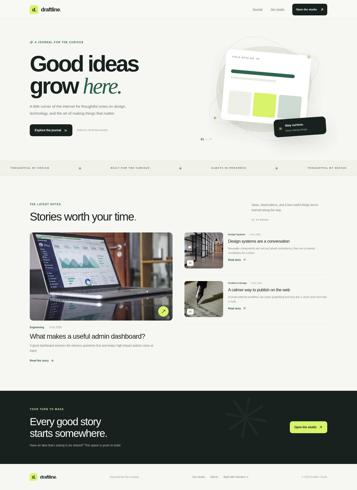
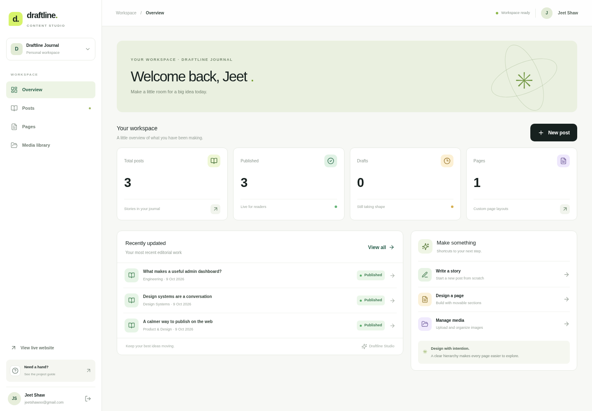
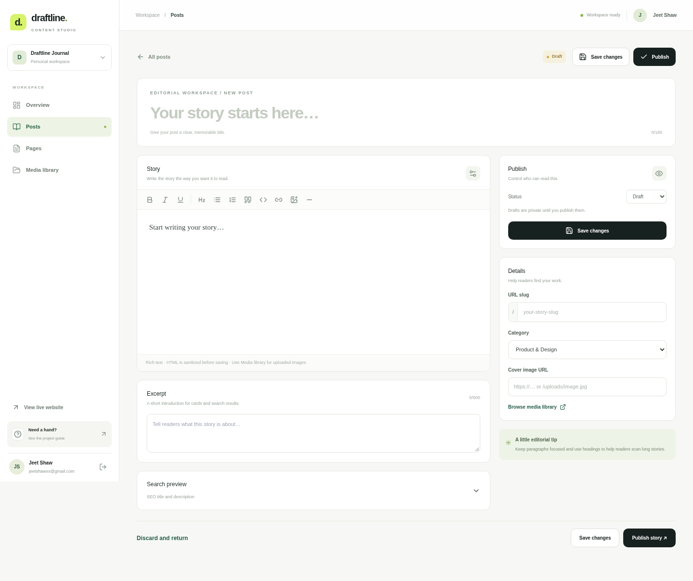
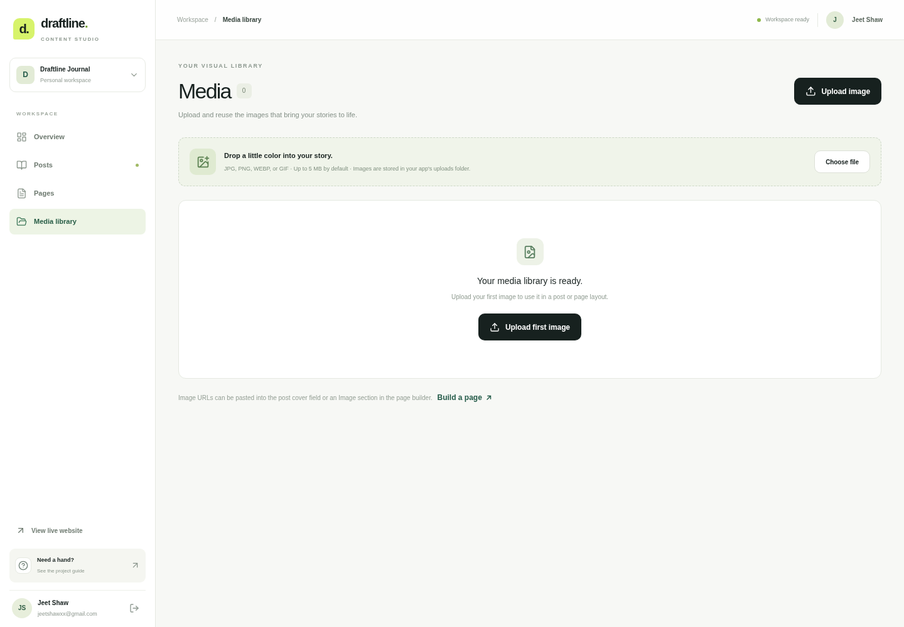

# Draftline 

**Project area:** Full-stack web development · Content Management System for a Blog  
 

Draftline is a full-stack editorial CMS built around a simple idea: a website owner should be able to write posts, design reusable page layouts, manage images, and publish changes without editing code. It is a portfolio-ready implementation of the first UCT Full Stack Internship project brief.

## What is included

- **Public-facing journal:** editorial home page, featured and recent stories, post detail pages, category/date metadata, related stories, and custom published pages.
- **Rich-text post editor:** headings, lists, quotes, links, images, and code blocks; editable title, URL slug, excerpt, category, cover image, SEO title, and description.
- **Draft and publish workflow:** drafts stay out of public listings; publish and update actions control visibility.
- **Visual page builder:** add Hero, Text, Image, Feature Grid, and Call to Action blocks; edit block properties; reorder sections by dragging; move sections with accessible buttons; save layouts as JSON in the database.
- **Media library:** upload JPG, PNG, WEBP, or GIF images, validate file signatures and sizes, update alternative text, copy an image URL, and delete unused files.
- **Protected admin studio:** hashed administrator password, signed session token in an HTTP-only cookie, logout, API authorization checks, and a basic login-attempt throttle.
- **SEO basics:** page/post metadata, Open Graph metadata for stories, readable slugs, and semantic public pages.
- **Health endpoint:** `/api/health` checks database connectivity.
- **Internship report and manual test plan:** see [`docs/PROJECT_REPORT.md`](docs/PROJECT_REPORT.md) and [`docs/TEST_PLAN.md`](docs/TEST_PLAN.md).

## Technology choices

| Layer | Technology | Reason |
| --- | --- | --- |
| UI and routing | Next.js App Router, React, TypeScript | Public pages and backend routes live in one application. |
| Styling | Tailwind CSS + a component-focused CSS layer | Responsive layout with a consistent editorial design system. |
| Rich text | Tiptap | Structured editing commands and semantic HTML output. |
| Drag-and-drop | dnd-kit | Reorderable page sections with keyboard support. |
| Database | Prisma ORM + SQLite (local/single-instance) | Simple local development and clear relational models. |
| Authentication | bcryptjs + jose + HTTP-only cookie | Password hashes and a signed, expiring admin session. |
| Input handling | Zod + sanitize-html | Request validation and rich-text HTML sanitization. |

## Run locally

### 1. Requirements

- Node.js 20 (20.9 or newer is recommended for the selected Next.js release)
- npm
- Git (for source control)

### 2. Install dependencies

```bash
cd uct-cms
cp .env.example .env
npm install
```

Open `.env` and set a unique secret. On Linux or macOS, generate one with:

```bash
openssl rand -base64 32
```

Paste that output as the value of `AUTH_SECRET`. Set your own `ADMIN_EMAIL` and a strong `ADMIN_PASSWORD` of at least 12 characters. `npm run db:seed` creates or updates that administrator using the values in `.env`.

Example local `.env` values (replace them before using the app beyond a local demo):

```dotenv
DATABASE_URL="file:../dev.db"
AUTH_SECRET="paste-a-unique-random-secret-of-at-least-32-characters"
ADMIN_NAME="Jeet Shaw"
ADMIN_EMAIL="jeet@example.com"
ADMIN_PASSWORD="Choose-A-Strong-Unique-Password"
NEXT_PUBLIC_SITE_URL="http://localhost:3000"
UPLOAD_MAX_MB="5"
```

Do not commit `.env`, database files, real user passwords, or private deployment values.

### 3. Create the database and sample content

```bash
npx prisma generate
npx prisma db push
npm run db:seed
```

The seed script creates an administrator, a few demonstration blog posts, a sample custom page, and base site settings. Re-running the seed updates the configured administrator and leaves existing demo post/page content intact.

### 4. Start the application

```bash
npm run dev
```

Open [http://localhost:3000](http://localhost:3000). The editorial website is public. Visit `/admin/login` to enter the studio with the email and password configured in `.env`.

Useful commands:

```bash
npm run typecheck      # TypeScript check
npm run lint           # Next.js ESLint rules
npm run db:studio      # Inspect the local database visually
npm run build          # Production build
npm start              # Start the production server after building
```

## Main routes

| Route | Purpose | Access |
| --- | --- | --- |
| `/` | Public journal homepage | Public |
| `/blog/[slug]` | Published blog post | Public; published posts only |
| `/p/[slug]` | Published visual page | Public; published pages only |
| `/admin/login` | Administrator login | Public login screen |
| `/admin` | Dashboard overview | Administrator |
| `/admin/posts` | Search, filter, edit, and delete posts | Administrator |
| `/admin/posts/new` | Create a post | Administrator |
| `/admin/pages` | Manage visual pages | Administrator |
| `/admin/pages/new` | Build a new page from blocks | Administrator |
| `/admin/media` | Upload and manage images | Administrator |
| `/api/health` | Database health check | Public operational endpoint |

## Data model

- `User`: administrator identity, role, and password hash.
- `Post`: editorial content, slug, excerpt, cover image, category, status, timestamps, SEO fields, and author.
- `Page`: slug, status, SEO metadata, and a JSON-serialized ordered block layout.
- `Media`: file metadata, storage filename, URL, alternative text, and uploader.
- `Setting`: basic site configuration values.

`ContentStatus` is used to separate `DRAFT` and `PUBLISHED` records. Public list/detail queries explicitly scope content to published records.

## Deployment and HTTPS

This app uses SQLite and local/persistent file storage, so deploy it as a **persistent Node.js web service**, not as a serverless function with an ephemeral filesystem. The following is a practical setup for Render or a similar host that supports a persistent disk:

1. Push this repository to GitHub and create a Node web service from the repository.
2. Attach a persistent disk mounted at `/var/data`.
3. Configure these environment variables in the host dashboard:
   - `DATABASE_URL=file:/var/data/dev.db`
   - `UPLOAD_DIR=/var/data/uploads`
   - `AUTH_SECRET=<a unique randomly generated value>`
   - `ADMIN_NAME=Jeet Shaw`
   - `ADMIN_EMAIL=<your chosen admin email>`
   - `ADMIN_PASSWORD=<a strong unique password>`
   - `NEXT_PUBLIC_SITE_URL=https://<your-assigned-hostname>`
4. Set the build command to `npm install && npm run build`.
5. Set the start command to `npx prisma db push && npm run db:seed && npm start`.
6. Open `/admin/login`, sign in, publish a story, and verify that it appears publicly.

The hosting provider should terminate TLS and redirect HTTP requests to HTTPS. Verify the final deployed URL and redirect behavior in the host dashboard before calling the site production-ready. Keep the database and upload directory on persistent storage; otherwise content or media may disappear on redeploy. For larger traffic or multiple application instances, migrate to managed PostgreSQL and object storage (such as an S3-compatible service) before horizontal scaling.

## GitHub workflow

Create a new repository named `uct-draftline-cms` under your GitHub account. From inside this folder:

```bash
git init
git add .
git commit -m "Build Draftline CMS for UCT full stack internship"
git branch -M main
git remote add origin https://github.com/jeetshawXX/uct-draftline-cms.git
git push -u origin main
```

If Git reports that the remote already contains a README or other commit, clone the new empty repository first or reconcile the histories before pushing. Do not use an existing unrelated repository as the remote.

## Implementation notes and limitations

- The database setup uses `prisma db push` for a compact student-project workflow. For a team or production release, generate and commit Prisma migrations, and run migrations through a deployment pipeline.
- Media is restricted to raster image formats and checked against basic file signatures. Production systems should add malware scanning and object storage/CDN policies.
- The login throttle is in-memory. It is useful for a single process demo but does not coordinate across multiple instances; use a shared rate limiter for a scaled deployment.
- SQLite is suitable for local development and a single persistent application instance. It is not the final choice for a horizontally scaled CMS.
- Rich text is sanitized on the server before storage and again when rendered in blog detail pages. Page-builder block properties are rendered as text; URL properties should still be entered as trusted paths or HTTPS links.
- UCT is the organization name included in the supplied brief. Add the official full company name, website, office details, mentor details, and internship dates from your actual internship material before final submission; they are intentionally not guessed here.

## Internship deliverables

- **Code:** this repository.
- **Project report:** [`docs/PROJECT_REPORT.md`](docs/PROJECT_REPORT.md).
- **Test plan:** [`docs/TEST_PLAN.md`](docs/TEST_PLAN.md).

<!-- SCREENSHOTS:START -->
## Screenshots

### Public Homepage


### Admin Dashboard


### Post Editor


### Media Library

<!-- SCREENSHOTS:END -->
